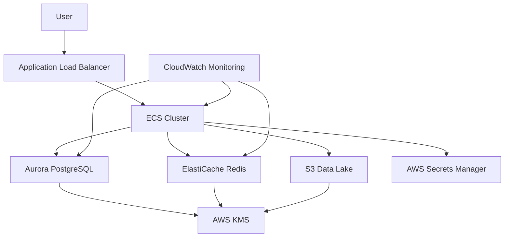

---

# 🚀 **AWS Terraform Foundation – FinTech Platform**

> **Enterprise-grade AWS Cloud Foundation for a FinTech Digital Banking Platform built with Terraform**

---

## 📌 **Project Overview**

This repository contains a **secure, scalable, and production-ready AWS cloud foundation** implemented using **Terraform Infrastructure as Code (IaC)**.

It is designed to support a **FinTech digital banking platform**, following:

* ✅ AWS Well-Architected Framework
* ✅ Multi-account architecture
* ✅ Strong security controls
* ✅ High availability
* ✅ Encryption by default
* ✅ Centralized monitoring
* ✅ Automated infrastructure deployment

---

## 🎯 **Objectives**

This infrastructure provides:

* Secure baseline AWS environment
* Repeatable deployments with Terraform
* Enterprise-grade cloud design
* Support for:

  * **Amazon ECS** (container workloads)
  * **Aurora PostgreSQL** (managed database)
  * **ElastiCache Redis** (in-memory cache)
  * **S3 Data Lake**
  * **CloudWatch Monitoring**
  * **AWS Secrets Manager**
  * **KMS Encryption**
  * **IAM Least Privilege**
  * **Tagging Governance**

---

# 🏗 **High-Level Architecture**

### 🔹 **Logical Architecture Diagram (Simplified)**



---

### 🔹 **AWS Multi-Account Architecture (Organizations)**

```
Root (Management Account)
│
├── Security OU
│   ├── Security-Audit
│   ├── Security-Logging
│
├── Infrastructure OU
│   ├── Shared-Services
│   ├── Network-Hub
│
└── Workloads OU
    ├── Production
    ├── Staging
    ├── Development
    └── Sandbox
```

🔐 **Applied Policies:**

* DenyRootUserAccess (SCP)
* Mandatory tagging:

  * `Environment`
  * `Project`
  * `CostCenter`

---

# 🌐 **VPC Networking Design**

### **VPC CIDR**

```
10.0.0.0/16
```

### **Subnet Layout**

```
VPC (10.0.0.0/16)
│
├── Public Subnets
│   ├── 10.0.1.0/24  (us-east-1a)
│   └── 10.0.2.0/24  (us-east-1b)
│
├── Private App Subnets
│   ├── 10.0.11.0/24 (us-east-1a)
│   └── 10.0.12.0/24 (us-east-1b)
│
└── Private DB Subnets
    ├── 10.0.21.0/24 (us-east-1a)
    └── 10.0.22.0/24 (us-east-1b)
```

### **Gateways**

* 🌍 Internet Gateway (IGW)
* 🔒 NAT Gateway for private subnet internet access

---

# 🧠 **Compute Layer – Amazon ECS**

### **ECS Cluster**

* Name: `fintech-cluster`
* Runs containerized applications
* Uses IAM execution role (least privilege)

### **Security**

* Dedicated ECS Security Group
* No public exposure
* Outbound traffic only via NAT Gateway

---

# 🗄 **Database – Aurora PostgreSQL**

* Engine: **Aurora PostgreSQL 14.8**
* Multi-AZ capable
* Encrypted with **AWS KMS**
* Runs in private subnets
* Accessible only from ECS

### Terraform Resources:

```hcl
aws_rds_cluster
aws_db_subnet_group
aws_security_group
```

---

# ⚡ **Caching – ElastiCache Redis**

* Engine: **Redis 7.0**
* Multi-AZ enabled
* TLS encryption enabled
* Auth token stored in **AWS Secrets Manager**
* Accessible only from ECS

---

# 📦 **Data Lake – S3**

### Buckets:

* `fintech-data-lake-<random_id>`
* `fintech-s3-logs-<random_id>`

### Features:

* ✅ Versioning
* ✅ Server-side encryption
* ✅ Public access blocked
* ✅ Intelligent Tiering
* ✅ Lifecycle policies
* ✅ Access logging enabled

---

# 🔐 **Secrets Management**

Stored in **AWS Secrets Manager**:

| Secret           | Path                   |
| ---------------- | ---------------------- |
| API Keys         | `fintech/api-keys`     |
| Redis Auth Token | `fintech/redis-auth`   |
| RDS Password     | Generated by Terraform |

ECS tasks have IAM permissions to read only required secrets.

---

# 🔑 **Encryption – AWS KMS**

Used for:

* RDS encryption
* Secrets Manager encryption
* S3 bucket encryption

Key alias:

```
alias/fintech-rds-key
```

---

# 📊 **Monitoring – CloudWatch**

Custom dashboard:

```
FinTech-Operations
```

Monitors:

* ECS health
* Database performance
* Redis metrics
* Application logs

---

# 🗂 **Terraform Remote Backend**

```hcl
terraform {
  backend "s3" {
    bucket         = "fintech-terraform-state-067970016113"
    key            = "aws-terraform-foundation/terraform.tfstate"
    region         = "us-east-1"
    dynamodb_table = "terraform-locks"
    encrypt        = true
  }
}
```

### Why this is best practice:

* Centralized state storage
* Versioned state
* State locking via DynamoDB
* Encrypted state files

---

# 🛡 **Security Best Practices Implemented**

✔ No public databases
✔ Encryption at rest & in transit
✔ IAM least privilege
✔ Secure secrets storage
✔ Network segmentation
✔ No hardcoded passwords
✔ Centralized tagging
✔ AWS Organizations SCP policies

---

# 🔁 **Deployment Workflow**

```bash
terraform init -reconfigure
terraform validate
terraform plan
terraform apply
```

---

# 🎯 **Project Status**

| Feature           | Status        |
| ----------------- | ------------- |
| Multi-Account AWS | ✅ Implemented |
| Terraform Modules | ✅ Implemented |
| Security Controls | ✅ Implemented |
| Monitoring        | ✅ Implemented |
| High Availability | ✅ Implemented |
| Encryption        | ✅ Implemented |

---

# 🏷 **Tags**

```
# AWS-Architecting-Capstone-Project
```

---
